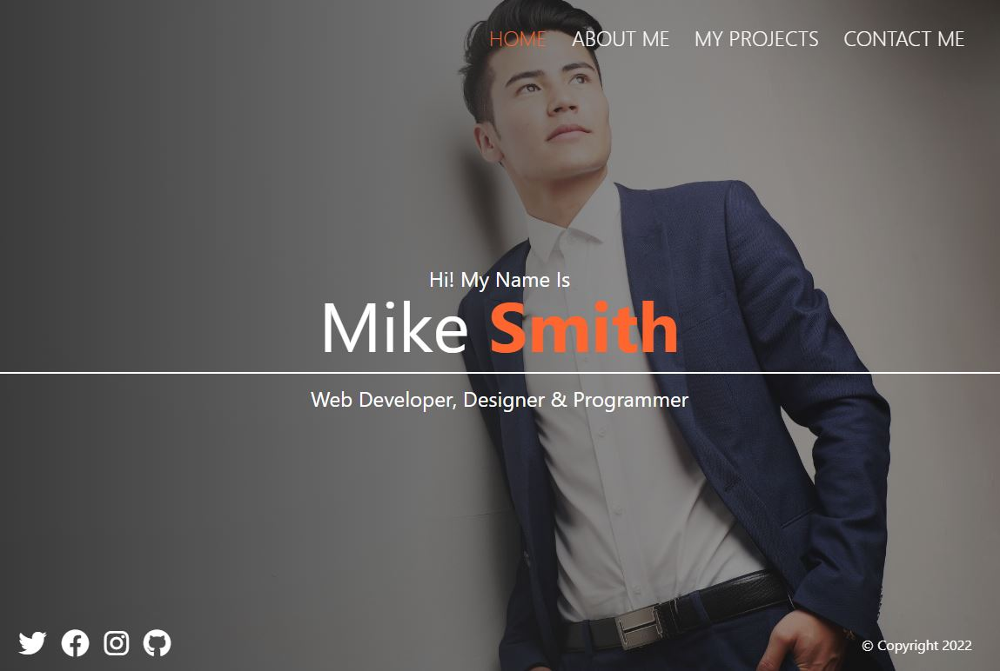

# sample portfolio with sass

# FreeCodeCamp - SASS tutorial

This is a page made from SASS tutorial by FreeCodeCamp. 

## Table of contents
- [Overview](#overview)
  - [Screenshot](#screenshot)
  - [Links](#links)
- [Built with](#built-with)
- [What I learned](#what-i-learned)
- [Author](#author)

## Overview
I coded along with the tutorial to learn and practice sass for css. It's a very nice looking portfolio made using sass. Structure is overcomplicated simply to show more advanced structure of a full project with the use of sass.

### Screenshot

### Links
- Live Site URL: [Link](https://app.netlify.com/sites/nimble-gaufre-77fa6e/overview)

## Built with
- HTML
- CSS
- SASS
- Vanilla Javascript

## What I learned
I learned to use SASS in order to enhance CSS use for styling websites. I learned to:
- import external scss files (I know I should rather use @use or @forward instead of @import now)
- functions and variables
- @mixins and @includes 
- use of partials for better project structure (like _config.scss or _responsive.scss)
- nesting of classes

## Author
- GitHub - [Marcin Suski](https://github.com/marcinsuski)
